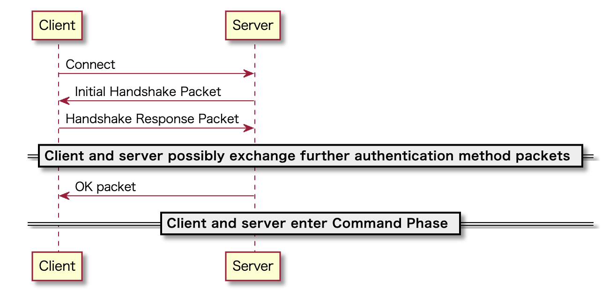
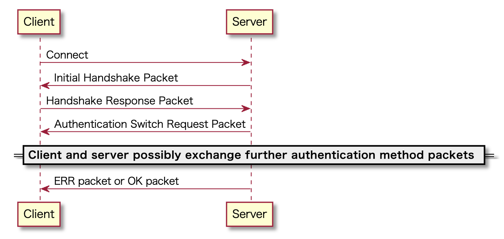
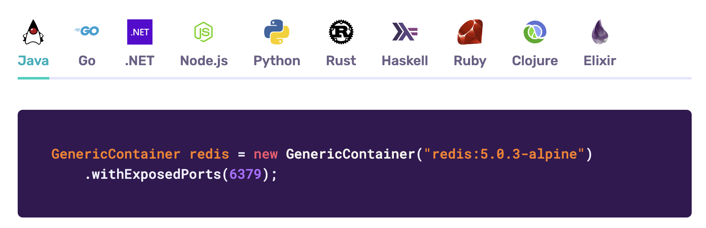

# Tetcontainersが便利だった

第一回ソフトウェアテストについて考える会
2024/03/22 (金)

株式会社 Nextbeat
富永 孝彦

---

# Testcontainersとは

[Testcontainers](https://testcontainers.com/)は、データベース、メッセージ ブローカー、Web ブラウザなど、Docker コンテナ内で実行できるほぼすべてのものの使い捨ての軽量インスタンスを提供するオープンソースフレームワークです。

---

この「使い捨ての軽量インスタンスを提供する」が非常に便利だった

---

# 何に使った？

---

現在趣味でScala用のデータベースライブラリを開発しています。

https://github.com/takapi327/ldbc


---

## これは何をしている？

Scalaは現在JVM, JS, Nativeというマルチプラットフォームに対応しています。

しかし、JDBCを使用したライブラリだとJVM環境でしか動作しません。

そのためMySQLプロトコルに対応したプレーンなScalaで書かれたコネクタを提供(こちらはまだ誠意開発中)することで、異なるプラットフォームで動作できるようにするために開発を行っています。

---

このMySQLプロトコルに対応したコネクタを作成する時に便利だった

---

# どのようなテストに役立ったのか？

---

MySQLの認証部分で役に立ちました

---

# MySQLはプラガブル認証

MySQLでは認証が様々なタイプのプラグインを付け外しできるようになっています。
選べる認証プラグインは[公式ページ](https://dev.mysql.com/doc/refman/8.0/ja/authentication-plugins.html)に記載されています。

先ほどのOSSでは以下3つの認証プラグインに対応しました。

- ネイティブプラガブル認証
- SHA-256 プラガブル認証
- SHA-2 プラガブル認証のキャッシュ

---

## ネイティブプラガブル認証

[ネイティブプラガブル認証](https://dev.mysql.com/doc/dev/mysql-server/latest/page_protocol_connection_phase_authentication_methods_native_password_authentication.html)のプラグインの名前は`mysql_native_password`です。

`mysql_native_password`はパスワードハッシュ方式に基づいた認証を実装しています。

---

## SHA-256 プラガブル認証

[SHA-256 プラガブル認証](https://dev.mysql.com/doc/refman/8.0/ja/sha256-pluggable-authentication.html)のプラグインの名前は`sha256_password`です。

サーバー側でsalt付きのパスワードハッシュ値を作成しており、SSL/TLS接続とRSA暗号化通信で送信するパスワードの形式が異なります。
- SSL/TLS接続時は安全な暗号化された通信経路での通信となるためパスワードの値をハッシュ化せずにそのままサーバーへ送信を行う
- RSA暗号化通信を行う場合はサーバーからRSA 公開鍵が送られてくるため、クライアントはその公開鍵を使用して暗号化したパスワードをサーバーへ送信する

簡単にいうと`mysql_native_password`をよりセキュアにしたもの。

---

## SHA-2 プラガブル認証のキャッシュ

[SHA-256 プラガブル認証](https://dev.mysql.com/doc/refman/8.0/ja/caching-sha2-pluggable-authentication.html)のプラグインの名前は`caching_sha2_password`です。

`sha256_password`認証プラグインは複数回のSHA256ハッシュを使用して、ハッシュ変換の安全性を高めていました。

ただし、暗号化された接続または RSA キー ペアのサポートが必要で、パスワードのセキュリティは強化されますが、安全な接続と複数回のハッシュ変換により、認証プロセスにより多くの時間がかかってしまうというデメリットがありました。

---

`caching_sha2_password`はこのデメリットを解消するために以下のような処理を行なっています。

1. SHA256を使用したパスワードハッシュで接続を行う(mysql_native_passwordと同じ)
2. ハッシュ化されたパスワードのキャッシュがサーバー内に存在するか確認を行う

ここでサーバー内にキャッシュが存在するかしないかによって後続の処理が変わる。

---

## キャッシュが存在する場合

キャッシュが存在する場合は`mysql_native_password`の時と同じようにパスワードのハッシュ値がクライアント・サーバー間で一致する場合は接続が成功となる。

---

## キャッシュが存在しない場合

1. SSL/TLS接続時もしくはRSA暗号化通信を行いクライアント・サーバー間で認証を行う
2. 認証が成立した場合、サーバーはその認証情報でパスワードのキャッシュをキャッシュ内に保存を行う

これにより次回以降の接続は、サーバー内のキャッシュを使用して高速に認証を行うことができるようになる。

---

超簡単にいうと`caching_sha2_password`は`sha256_password`のパフォーマンスを向上させたもの。

SHA-2 プラガブル認証のキャッシュを使用する場合、キャッシュの有無に応じて処理が必要
もちろんキャッシュの有無によるテストも必要となる

---

# MySQLの認証処理



---

ここでMySQLサーバーから最初に送られてくるパケットの中にMySQLサーバーデフォルトの認証プラグイン情報が入っています。

クライアントはまずその認証プラグインを使って接続を行い、問題なければ接続完了となります。

---

# サーバーとクライアントの認証プラグインが違う場合はどうなるのか？

---

サーバーとクライアント間で認証方法の変更が行われます



---

例えば

サーバーが`mysql_native_password`でUserの使用プラグインが`sha256_password`であった場合、まず`mysql_native_password`プラグインの処理で接続を行います。

するとサーバーから「アンタの使用しているプラグインは`sha256_password`やで！」と言われるので、
クライアント側は再度指定された`sha256_password`プラグインの処理で接続を行い、問題がなければ接続完了になるという感じです。

---

このようにサーバーとクライアントで認証プラグインが異なる場合を想定して作成する必要がある。

---

作成しているOSSはMySQLの5.7系と8系をサポートしている

---

# つまり

- MySQLバージョン x 2
- MySQLサーバーデフォルトの認証プラグイン3種類
  - MySQL 5.7では`caching_sha2_password`はサポートされていない
- SSL/TLS使用の有無
- クライアント側の認証プラグイン3種類
- `caching_sha2_password`
  - 上記組み合わせ x 2
  - キャッシュの有無

これらを全て組み合わせた環境が必要

---

|クライアント|バージョン|サーバーと一致|SSL/TLS|キャッシュ有無|
|:---:|:---:|:---:|:---:|:---:|
|`mysql_native_password`|5.7|✅|❌||
|`mysql_native_password`|5.7|❌|❌||
|`mysql_native_password`|5.7|✅|✅||
|`mysql_native_password`|5.7|❌|✅||
|`sha256_password`|5.7|✅|❌||
|`sha256_password`|5.7|❌|❌||
|`sha256_password`|5.7|✅|✅||
|`sha256_password`|5.7|❌|✅||
|`caching_sha2_password`|サポート対象外||||

---

|クライアント|バージョン|サーバーと一致|SSL/TLS|キャッシュ有無|
|:---:|:---:|:---:|:---:|:---:|
|`mysql_native_password`|8|✅|❌||
|`mysql_native_password`|8|❌|❌||
|`mysql_native_password`|8|✅|✅||
|`mysql_native_password`|8|❌|✅||
|`sha256_password`|8|✅|❌||
|`sha256_password`|8|❌|❌||
|`sha256_password`|8|✅|✅||
|`sha256_password`|8|❌|✅||

---

|クライアント|バージョン|サーバーと一致|SSL/TLS|キャッシュ有無|
|:---:|:---:|:---:|:---:|:---:|
|`caching_sha2_password`|8|✅|❌|❌|
|`caching_sha2_password`|8|❌|❌|❌|
|`caching_sha2_password`|8|✅|❌|✅|
|`caching_sha2_password`|8|❌|❌|✅|
|`caching_sha2_password`|8|✅|✅|❌|
|`caching_sha2_password`|8|❌|✅|❌|
|`caching_sha2_password`|8|✅|✅|✅|
|`caching_sha2_password`|8|❌|✅|✅|

---

それぞれ常に綺麗な環境を用意したい

---

Dockerの設定で管理するのめんどくさい...
docker-compose.yamlに同じような設定が乱立...
yamlの設定見ただけでは何用かよくわからん...

---

# そうだTestcontainersを使おう！

---

TestContainerは予想される動作に応じて、次の4つの特性のいずれかをテストに組み込むことができます。

- TestContainerForAll — すべてのテストの前に単一のコンテナを開始し、すべてのテストの後に停止する。
- TestContainerForEach — 各テストの前に1つのコンテナを開始し、各テストの後に停止する。
- TestContainersForAll — すべてのテストの前に複数のコンテナを開始し、すべてのテストの後に停止する。
- TestContainersForEach — 各テストの前に複数のコンテナを起動し、各テスト後に停止する。

---

Dockerコンテナは、2つの異なるエンティティを通じて表現される

- ContainerDef - ContainerDefは、コンテナの構築方法を記述する。コンテナのコンストラクタやdockerfileの記述のように考えることができる。
- Container - 起動したコンテナです。そのメソッドを通してコンテナの情報を扱える。

---

`MySQLContainer`を使用してコンテナの定義を行う。
ここでサーバーのバージョンやユーザーの設定を行う。

```scala
  override val containerDef = MySQLContainer.Def(
    dockerImageName = DockerImageName.parse("mysql:8.0.33"),
    databaseName = "...",
    username = "...",
    password = "..."
  )
```

※ 追加のUser情報作成などはTestcontainersの拡張が必要

---

`withContainers`を使用することでテストで使用しているコンテナのエンティティを使用できる

```scala
  test("test") {
    withContainers { container =>
      ...
    }
  }
```

この`container`からTestContainerで生成したコンテナ(MySQL)の`jdbcUrl`や`username`,`password`が取得できるので、この情報を使ってコネクションを作成すればTestContainerのMySQLへ接続でき、その環境でテストができる。

---

こんな感じ

```scala
class Test extends TestContainerForAll {
  override val containerDef = MySQLContainer.Def(
    dockerImageName = DockerImageName.parse("mysql:8.0.33"),
    databaseName = "...",
    username = "...",
    password = "..."
  )

  test("test") {
    withContainers { container =>
      ...
    }
  }
}
```

---

これで、それぞれの条件用のテストコードを書くだけで全ての環境を作成できる！
設定がテストコードと一緒に管理できるので、Dockerの設定を管理する必要がなくなった！

テスト起動時に立ち上がり、テスト終了時に停止してくれるのでテストの環境管理も不要になった！

こういう環境を変えてテストをしたいという時に超便利！

※ コンテナ起動に時間がかかるためテスト時間がその分伸びてしまうことに注意

---

## 色々な言語で使用可能

Scalaだけではなく色々な言語にも対応しています。



---

Testcontainers Desktopとか色々開発されてて面白い

https://testcontainers.com/desktop/

---

みんなもTestcontainers使ってみよう！

---

ご清聴ありがとうございました。
