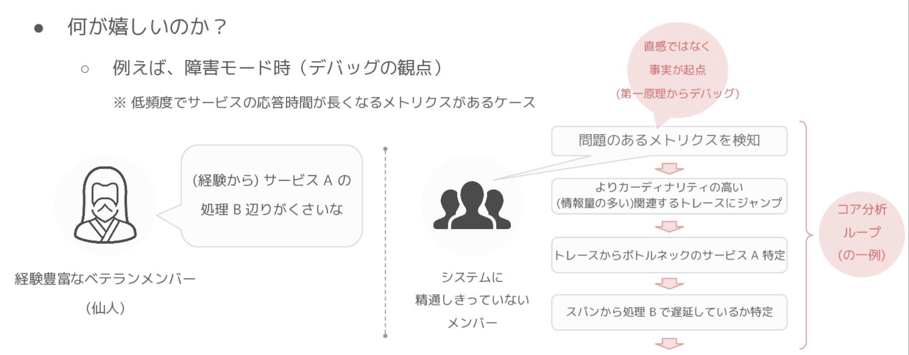
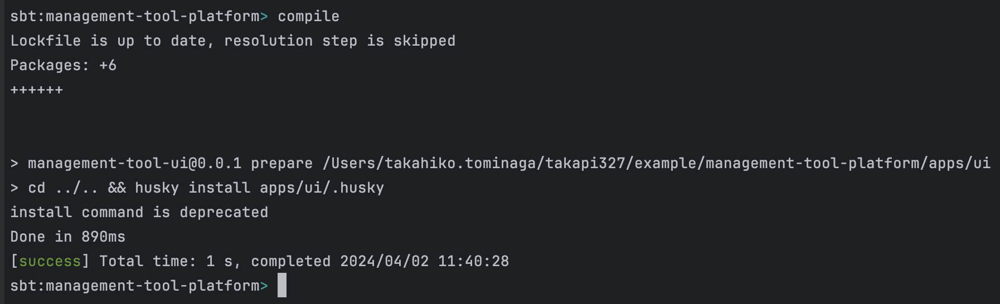
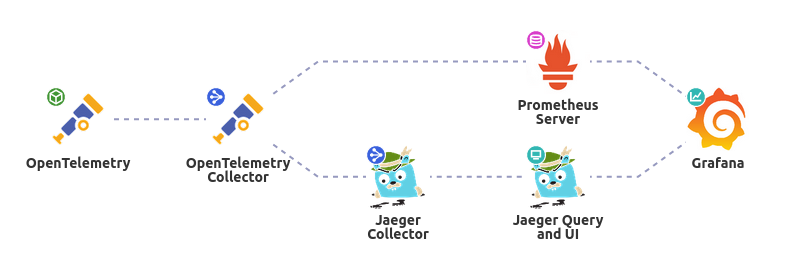
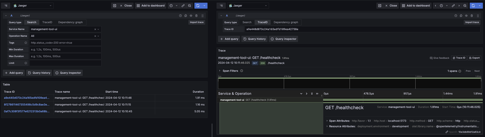

# Svelte5 x Scala3 ~オブザーバビリティ駆動開発~

Nextbeat
2024/04/12 (金)

富永 孝彦

---

# 前回のあらすじ

オブザーバビリティ駆動開発 2024/03/15 (金) を見てね

---

## オブザーバビリティは

- 予期せぬトラブルを防ぐ仕組み
- 可観測性が重要
- メトリクス x ログ x トレースの組み合わせ

---


[引用](https://speakerdeck.com/k6s4i53rx/otel-trace-exemplar?slide=9)

---

ハイパーメニーメニートゥーリッチローカル開発環境

---

# 今日は何を話す？　

- フロントエンドとバックエンドの型安全性
- フロントエンドとバックエンドで言語が異なる時のモノレポ (笑)
- フロントエンドでの可観測性
- フロントエンドとバックエンドの可観測性

---

## 改めて技術スタックは

Svelte5 x Scala3

Svelteが仲間入り！

---

### バックエンドの構成

Typelevelスタック with tapir

- バックエンド: Scala 3 x Cats Effect 3 x http4s x tapir x ldbc
- DB: MySQL v8
- 計装: Otel4s

---

### フロントの構成

- フロントエンド: Svelte 5 x SvelteKit x express x Zod x Zodios (Typescript)
- 計装: opentelemetry

---

## さらなる型安全性を求めて

APIの型安全性を高めるために、ZodとZodiosを使用

---

Scala x Tapirで定義したAPIの型をOpenAPIの仕様書として使用

OpenAPI仕様書からZodiosとZodを使用したAPIクライアントを生成し、フロントエンドにも型を伝播

---

## 何が嬉しいのか？

- バックエンドとフロントエンドの型が一致
  - コンパイルで型の不整合を検知
- バックエンドの変更に伴うフロントエンドの修正が減る
  - 修正漏れがあればコンパイルエラーで検知

---

フロントが楽になる

- フロントエンドの型安全性が向上
- フロントエンドの開発速度が向上
- フロントエンドの品質が向上
- フロントエンドのテストが楽になる
- フロントエンドのリファクタリングが楽になる
- etc...

バックエンドも楽になる

- 送られてくる内容は全て型で表現される
- テストが楽になる
- リファクタリングが楽になる
- etc...

---

## NodeとJVMのモノレポ？

フロントエンドとバックエンドで使用技術が別れていると環境構築やテスト、リリースが面倒になる

それぞれ別管理すると、バージョンの不整合や依存関係の問題が発生しやすい

---

言語が統一されたモノレポは、依存関係の問題が少なくなり便利

---

じゃあ言語が統一できない場合は？

今回だと、フロントエンドはTypescript、バックエンドはScala

---

### sbtで全部管理しよう！

---

sbtは独自のコマンドを追加したりできる

具体的にはpnpmという名前のタスクを追加して、フロントエンドの管理をsbtで行う

```scala
lazy val pnpm = inputKey[Unit]("pnpm command with arguments")
```

---

追加したタスクにpnpmのコマンドを実行する処理を追加

- ユーザー引数をスペースで区切り、それを一つの文字列に結合
- 実行するpnpmコマンドの作成
- pnpmコマンドを実行
- タスク実行情報をログに書き出す
- エラーが発生した場合は停止

```scala
pnpm := {
  val taskName = spaceDelimited("<arg>").parsed.mkString(" ")
  pnpmInstall.value
  val localPnpmCommand = "pnpm " + taskName
  def runPnpmTask(): Int = Process(localPnpmCommand, uiDirectory.value).!
  streams.value.log("Running pnpm task: " + taskName)
  haltOnCmdResultError(runPnpmTask())
}
```

---



---

### 嬉しさ

- ScalaとSvelteのコードを一緒に管理できる
- Compile時にScalaとSvelteのコードをまとめて型チェックできる
- Test実行でScalaとSvelteのテストをまとめて実行できる
- Run実行でScalaとSvelteのサーバーをまとめて起動できる

つまり CI/CDをそれぞれ用意する必要がない

先ほどのAPIの型安全性もこれでまとめて検知できる

---

## フロントエンドの可観測性

---

フロントエンドも計装はOpenTelemetryで行う

Nodeは`@opentelemetry/xxx`のパッケージを複数組み合わせて使う

バックエンドと同じように`OpenTelemetry`を使用して計装を行い、`OpenTelemetry Collector`を使用してデータを収集する

`OpenTelemetry Collector`から`Prometheus`, `Jaeger`にデータを送信し、`Grafana`にデータを集約する



---

[@opentelemetry/sdk-trace-node](https://github.com/open-telemetry/opentelemetry-js/tree/main/packages/opentelemetry-sdk-trace-node)を使用してテレメトリデータの収集を行う

---

- トレース/メトリクス情報を`OpenTelemetry Collector`に送信
- プラグインを使用してHttpリクエストの計装/Expressの計装を行う
- `sdk.start()`で計装を開始

```javascript
const sdk = new NodeSDK({
  resource: resource,
  traceExporter: new OTLPTraceExporter({
    url: process.env.OTEL_COLLECTOR_URL || 'http://otel-collector:4317'
  }),
  metricReader: new PeriodicExportingMetricReader({
    exporter: new OTLPMetricExporter({
      url: process.env.OTEL_COLLECTOR_URL || 'http://otel-collector:4317'
    }),
  }),
  instrumentations: [
    new HttpInstrumentation({
      requestHook: (span, request) => {
        span.updateName(`${request.method} ${request.url}`)
      }
    })
  ],
})

sdk.start()
```

---

`Dockerfile`の設定で、起動時に`instrumentation.cjs`を読み込むようにする

```Dockefile
CMD ["node", "--require", "./instrumentation.cjs", "./server.js"]
```

---



---

これでフロントエンドの情報もGrafanaで見れるようになった！

---

でもまだ課題がある

---


これだとフロントエンドとバックエンドの処理の紐付きがわからない...
フロントエンドで呼ばれたバックエンドの情報はAPIを呼んだであろう時間をもとに探さないといけない...
大量の情報から探し出すのは困難...
ここに時間がかかる = 障害復旧時間が長くなる
手間がかかるというイメージは日々見るということを遠ざける...

---

`OpenTelemetry`には`SpnaLinks`という`Span`情報を関連づける機能がある！

これを使えばフロントエンドとバックエンドのテレメトリデータを関連づけられる！

---

アプリケーションの流れとしてフロントエンドがまず呼ばれてその後バックエンドが呼ばれる

つまりテレメトリデータもフロントエンドからバックエンドへ流れていく

なので、何かしらの方法でフロントエンドからバックエンドへテレメトリデータの受け渡しを行う

フロントエンドとバックエンドの連携はAPIリクエストを通して行われるので、そのAPIリクエストにテレメトリデータを付与する

---

## APIクライアントは自動生成してるけどどうする？

APIクライアントはZod x Zodiosを使用している

---

Zodiesは独自にプラグインを作成して組み込むことが可能

https://www.zodios.org/docs/client/plugins

---

APIリクエスト時にトレースが開始されていた場合にそのトレース情報をヘッダー情報に組み込むようにプラグインを作成

---

```typescript
export const tracerPlugin = (): ZodiosPlugin => {
  return {
    name:    'settingTraceHeaders',
    request: (
      api: ZodiosEndpointDefinitions,
      config: ReadonlyDeep<AnyZodiosRequestOptions>
    ): Promise<ReadonlyDeep<AnyZodiosRequestOptions>> => {
      const currentSpan = trace.getSpan(context.active())
      if (currentSpan) {
        const traceId = currentSpan.spanContext().traceId
        const traceFlags = currentSpan.spanContext().traceFlags
        const spanId = currentSpan.spanContext().spanId

        const newHeaders = {
          ...config.headers,
          'X-B3-TraceId':      traceId,
          'X-B3-ParentSpanId': spanId,
          'X-B3-TraceFlags':   traceFlags.toString()
        }

        return Promise.resolve({
          ...config,
          headers: newHeaders
        })
      } else {
        return Promise.resolve(config)
      }
    }
  }
}
```

---

SvelteKitの`hooks.server.ts`でクライアント生成時に有効化しておく

```ts
export const handle = sequence(async ({ event, resolve }) => {
  event.locals.api = createApiClient(env.PUBLIC_API_SERVER_URL)
  event.locals.api.use(tracerPlugin())
  return resolve(event)
})
```

---

バックエンドではヘッダー情報からトレース情報を取得する

```scala
val contextOpt: Option[SpanContext] =
  for
    traceId    <- req.headers.get(CIString("X-B3-TraceId"))
    traceFlags <- req.headers.get(CIString("X-B3-TraceFlags"))
    spanId     <- req.headers.get(CIString("X-B3-ParentSpanId"))
  yield SpanContext(
    ByteVector.fromValidHex(traceId.head.value),
    ByteVector.fromValidHex(spanId.head.value),
    TraceFlags.fromByte(traceFlags.head.value.toByte),
    TraceState.empty,
    true
  )
```

---

あとはあればLinkを設定すれば完了

```scala
contextOpt
  .fold(builder)(builder.addLink)
  .build
```

---

しかし、リンク情報は表示されない...

---

調べたらJaegerがサポートしてなかった...

---

仕方ないので、リンクではなく親子関係を組むことに

```scala
contextOpt
  .fold(builder)(builder.withParent)
  .build
```

---

# できたもの

---

# 次は

- トレースとメトリクスの関連付け
  - トレースエグザンプラー
- フロントエンドのテレメトリデータ充実
- フロントxバックの関連付けがやっぱり微妙？なのでJaegerから別のものを検討？

---

最近オブザーバビリティに関するイベント増えてきた？印象なので参加してみると良いかも

3日前ぐらいのイベントも良かった
[OpenTelemetry Observability運用の実例 Lunch LT](https://findy.connpass.com/event/313260/)
