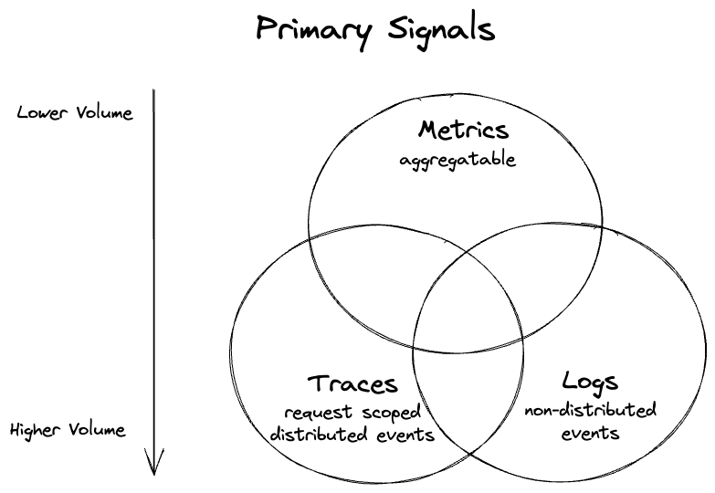
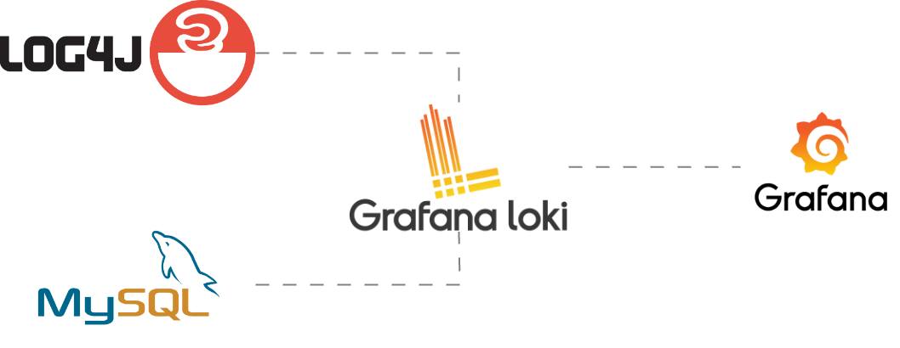
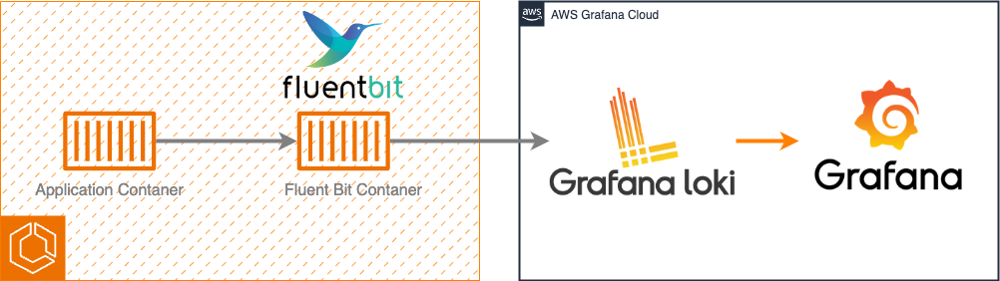
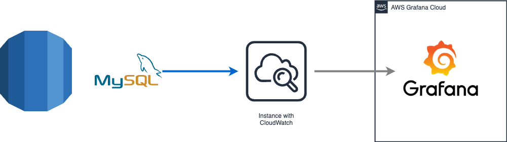
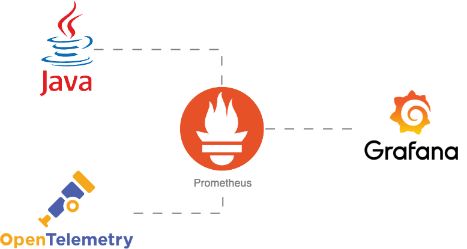
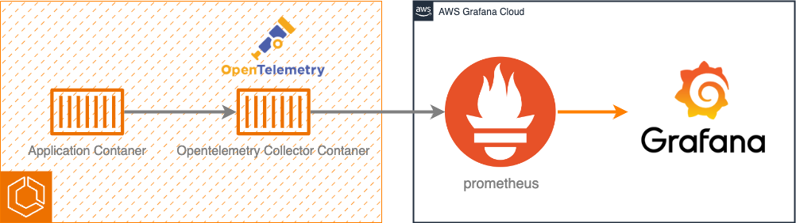

# オブザーバビリティ駆動開発

Nextbeat
2024/03/15 (金)

富永 孝彦

---

# 今日話すこと

趣味の箸休めに作ってるサービスの話
このサービスの構築でマイブームであるオブザーバビリティ駆動開発の嬉しさを語る

---

# 今日話さないこと

- 使用している技術の説明

---

まだ、本読んだり作りながら修正している段階...
だから間違ってる可能性もある！

---

# オブザーバビリティとは？

---

## 予期せぬトラブルを防ぐ仕組み

---

オブザーバビリティ（Observability）とは、「観測する」オブザーブ（Observe）と、「能力」アビリティ（Ability）を組み合わせた複合語で日本語では「可観測性」あるいは「観測する能力」などと訳されます

システム上で何らかの異常が起こった際に、それを通知するだけでなく、どこで何が起こったのか、なぜ起こったのかを把握する能力を表す指標、あるいは仕組みを指します。

---

# 「可観測性」と「監視」

---

まずはじめに、「可観測性」と「監視」は別物です。

「監視」は既知の問題に対処します。
メトリクスを設定して特定の問題が発生したときに検知します。

「可観測性」は未知の問題に対処します。
カーディナリティが高く高次元の構造化されたテレメトリデータにより、探索的に問題の発生地点にたどり着くことができます。

---

監視はシステムの状態を見続けることに対し、オブザーバビリティはシステムで何が起きているのかを把握するためのものと言えます。

---

クラウドベンダー／コンテナ／オーケストレーションツール／プロビジョニングツール等の進化のおかげで複雑なクラウドシステムをデプロイする閾値はこれまでになく下がっています。

一方で運用・保守の難易度はシステムの複雑さに応じて上がってきています。
複雑になればなるほどこれまでにないタイプのエラーが発生します。
そのようなバグのデバッグで最も難しいのは、コードがどのように実行されるかを理解することではなく、システム内のどこに問題のあるコードが存在するかを見つけることです。

初めて出会うエラーに対処できる可観測性の重要性が高まってきているのです。

---

## 予期せぬトラブルを防ぐ仕組み

---

# 障害が起きた時どうやって原因調査していますか？

---

おそらく

1. アラート検知
2. ログ確認
3. ALBのアクセス確認
4. etc...

---

これだと発生時間でしかエラーと紐付けができない...
ユーザーがどのような操作を行なったかがわからない...
アプリケーションがどう動いていたかがわからない...
非同期？同期？並列？

---

# 負荷が高い原因調査はどうやってしていますか？

---

おそらく

1. アラート検知
2. メトリクスを見る

---

なんの処理が原因だったかわからない...
メトリクスだけでは不十分...
根本原因がわからない...

---

# 監視を始めるタイミングは？

---

現状だとリリースしてからのみ

---

プロダクトがスケールしていくにつれてどんどんしんどくなる

---

# オブザーバビリティ駆動開発は

---

開発段階からオブザーバビリティを意識した開発を行うことによって事前に原因を把握解消し、
問題が起きた場合は、一貫性を持って原因調査できるようにするもの

---

でも、そもそも監視の環境を整備するのが大変...

---

# サービス

外部サービスを使って監視しよう！

よく聞くサービスだと

## [Data Dog](https://www.datadoghq.com/ja/?utm_source=google&utm_medium=paid-search&utm_campaign=dg-brand-apac-ja-brand&utm_keyword=data%20dog&utm_matchtype=p&utm_campaignid=8700484236&utm_adgroupid=84283271981&gad_source=1&gclid=CjwKCAiA_5WvBhBAEiwAZtCU73jJa2uznZspaWE8CCxsLXrtVycnhvkgUstojFOx29uiSVQSzgxysRoCqJMQAvD_BwE)

## [New Relic](https://www.dynatrace.com/monitoring/platform/comparison/dynatrace-vs-new-relic/?utm_source=google&utm_medium=cpc&utm_term=why-dynatrace-nr-st&utm_campaign=jp-en-why-dynatrace&utm_content=none&utm_campaign_id=16527149421&gclsrc=aw.ds&gad_source=1&gclid=CjwKCAiA_5WvBhBAEiwAZtCU730pwqu0JCRAErKnKnwjKdQ4c1muT5jZc5jRODgBJnA6CGLYHuamUBoC1kIQAvD_BwE)

---

高い...

---

(会社) 
使えるかわからないのに導入しづらい...
ほんとにリターンくるの？

---

# できるだけ安く実現してみよう

---

## 技術スタック

CNCFプロジェクト

### 計装

- Grafana
- Grafana Loki
- OpenTelemetry
- Jaeger
- Prometheus

---

# CNCF

[CNCF(Cloud Native Computing Foundation)](https://www.cncf.io/) とは Linux Foundation のプロジェクトの 1 つで、クラウドネイティブなコンピューティングシステムを推進するための非営利団体

[Github](https://github.com/cncf)

---

### アプリケーション

Typelevelスタック with tapir

- 言語: Scala 3
- API: Cats Effect 3 x http4s x tapir
- DB: MySQL x LDBC
- 計装: Otel4s

---

# オブザーバビリティに必要不可欠な3要素とは？

---

## ログ：分析することで、根本原因にたどりつく

ログはOSやミドルウェア、アプリケーションなどから出力されるテキスト情報です。主に障害発生時にこの情報を元に原因究明を行います。

ただし、ログはあくまでも「結果」にすぎません。
どのようなプロセスを経てこの結果が導かれたのかがわからないので、その結果を正確に再現することが難しい。

---

## メトリクス：数値化された情報

メトリクスは、定期的にグループ化または収集されたデータの集計です。メモリ使用率やCPU使用率、ネットワーク使用率などの情報から「何が起きているのか」を秒単位で検知できるようにするためのもの。

メトリクスデータによって、アプリケーションの動きやハードウェアの稼働状態が可視化でき、システム全体がどのように動いているのかを把握することが可能になる。

---

## トレース：対処するための出発点

トレースは、根本的な原因にいち早くたどりつくために、問題が起こった処理のプロセスを可視化したデータです。トラブルシューティングを行ったり、障害が起こった箇所を特定したりという作業が、これにあたります。

オブザーバビリティでは、システムの構成要素をすべて関連付けて、トレースによって「どこで問題が起こったのか」「どのような処理を行なった結果それが起こったのか」を容易に突き止めることができるようにします。

---

- ログ
  - 地点を観測
- メトリクス
  - 幅を観測
- トレース
  - 期間を観測

[参照](https://github.com/cncf/tag-observability/blob/main/whitepaper.md)

---

他にも可観測性の3大要素や3本の柱など色々あるよ

---

# それぞれどうやって構築しているか

---

## ログ

アプリやサーバで発生している個別のイベント（エラーログ、アクセスログなど）に関しては、現在OpenSearchとKibanaを使用した運用としているがログの確認がしづらいという問題点がある。

またデータベースで発生したログに関してはCloudWatchを確認しており、レイヤーによって確認する箇所が異なっている。

---

### ローカル環境構成図

---

### AWS環境構成図

**アプリケーション**

アプリケーションでlog4jなどを使用してログを吐き出し、、サイドカーコンテナでFluent Bitを使用しGrafana Lokiへ送信を行う。
最終的には、GrafanaでGrafana Lokiのデータを集約する。

---

**データベース**

AuroraではCloudWatchへログを吐き出し、GrafanaでCloudWatchのデータを集約する。

---

# メトリクス

メトリクスを取得する目的としては、サーバのリソース状況（CPU使用率など）やサービス状況（レイテンシ、トランザクション量、エラーレートなど）といった、特定の時間間隔で測定された数値データを取得することでパフォーマンスチューニングや、ECSやAuroraといったマネージドサービスのスペックを調整するために使用するためです。

---

### ローカル環境構成図

JVMのアプリケーションはJava AgentとJMX Exporterを使用
別途OpenTelemetryを使用してメトリクスデータを収集

---

### AWS環境構成図

ECSで表示されているメトリクスだけではJVM上のアプリケーションがメモリをどのように使用しているか等の情報を正確に収集できない。

そのためJVMのメモリやCPUの監視を行うために、JavaAgentを使用してJMX Exportでメトリクスを吐き出しPrometheusで収集しGrafanaで監視を行う。

---

# トレース

トレースを取得する目的としては、どのような処理が重たいのか、そのボトルネックはどこの処理なのかを可視化して調査を容易にするためです。

---

### ローカル環境構成図

アプリケーションでOpenTelemetryを使用したテレメトリデータを収集し、OpenTelemetry Collectorを使用しPrometheusへ送信を行う。

---

### AWS環境構成図

アプリケーションでOpenTelemetryを使用したテレメトリデータを吐き出し、サイドカーコンテナでOpenTelemetry Collectorを使用しPrometheusへ送信を行う。
最終的には、GrafanaでPrometheusのデータを集約する。

---

# できたもの

---

ハイパーメニーメニートゥーリッチローカル開発環境

---

デモ

[Grafana](http://localhost:3000/?orgId=1)

1. アプリケーションログの確認
2. データベースログの確認
3. 独自メトリクスの確認
4. トレースの確認
5. ログとトレースの組み合わせ
6. JVMの監視

---

ハイパーメニーメニートゥーリッチローカル開発環境

---

# 最後に

---

- オブザーバビリティは作って終わり、導入して終わりではない
  - 導入しただけでは意味がない
  - 日々改修する必要がある
- 構築はインフラだけでもアプリケーションだけでも無理
  - 対応は両方を考慮して行う必要がある
- 小さなプロジェクトでは効力は少ないが大きくなってからでは少し遅い
  - 変化がわからないから
  - 組み込むのも大変

---

自分もまだまだ今までの監視にトレースを追加した程度のレベル

---

オブザーバビリティ駆動開発を考える会
(with Effect System？)

---

この本がオススメ！

[オブザーバビリティ・エンジニアリング](https://www.amazon.co.jp/%E3%82%AA%E3%83%96%E3%82%B6%E3%83%BC%E3%83%90%E3%83%93%E3%83%AA%E3%83%86%E3%82%A3%E3%83%BB%E3%82%A8%E3%83%B3%E3%82%B8%E3%83%8B%E3%82%A2%E3%83%AA%E3%83%B3%E3%82%B0-Charity-Majors/dp/4814400128/ref=sr_1_1?adgrpid=145059206056&dib=eyJ2IjoiMSJ9.mEmr8jYY1Rx4eqIw2RM5hJIxGRwM058pQP6ZmWGTiMiPc2SeOnRs_zHraKTErXyQl6j-m2qCc0huGWdOGGhFMxYMmU0auHPZhVOEqjCjJXIEX4Z5j1qzug-WyBet8udY517gCGvXspf1k15uN059oQ.Gi0FHnU6qbcV0vqBBxYwmJvcY9AvHk-oksbUtWPHsPI&dib_tag=se&gclid=CjwKCAiA_5WvBhBAEiwAZtCU7y3mvg16O8Su8Cm9t5w_WPoikA6Cj9dFWpSYwFX_-fXaGw0uOzSRwBoCp-YQAvD_BwE&hvadid=679073047654&hvdev=c&hvlocphy=1009308&hvnetw=g&hvqmt=e&hvrand=14820850245863278725&hvtargid=kwd-1934908670071&hydadcr=27711_14738816&jp-ad-ap=0&keywords=%E3%82%AA%E3%83%96%E3%82%B6%E3%83%BC%E3%83%90%E3%83%93%E3%83%AA%E3%83%86%E3%82%A3%E3%83%BB%E3%82%A8%E3%83%B3%E3%82%B8%E3%83%8B%E3%82%A2%E3%83%AA%E3%83%B3%E3%82%B0&qid=1709616659&sr=8-1)

AWSにはハンズオンもあるよ！

https://catalog.workshops.aws/observability/ja-JP
